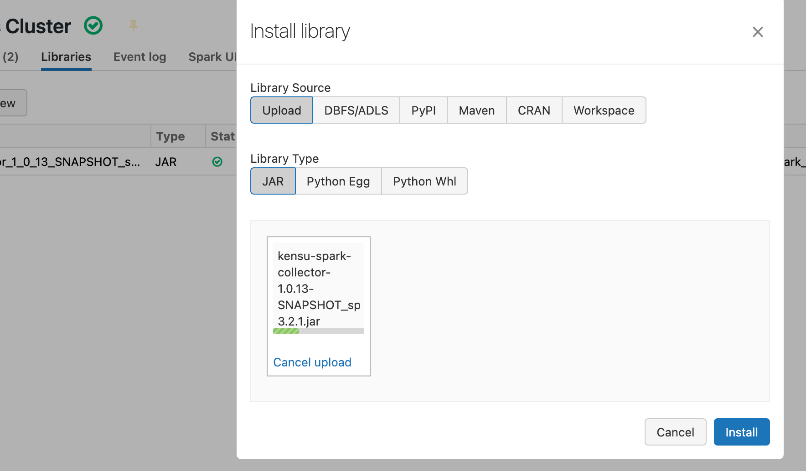

Overview
---------

The .ipynb versions of Databricks notebooks can be previewed directly in Github:
- report to kensu servers: [demo_load_financial_data_copy1.ipynb](./demo_load_financial_data_copy1.ipynb)
- report to file: [demo_load_financial_data_copy3_offline.ipynb](./demo_load_financial_data_copy3_offline.ipynb)

Setup
---------

- create a databricks cluster using `Spark 3.2`.
- download Kensu collector jar from [here](https://public.usnek.com/n/repository/public/releases/kensu-spark-collector/rc/kensu-spark-collector-1.0.13-SNAPSHOT_spark-3.2.1.jar) and upload to `Databricks cluster libraries` like this:

- upload conf file to DBFS: `/FileStore/conf/spark_v1_0_offline.conf`  (or modify notebook for different path)
- upload sample data to DBFS `/FileStore/Financial_Data_Report/` from [../Financial_Data_Report/datasources](../Financial_Data_Report/datasources) (in particular all files from  `2021/dec` directory into `/FileStore/Financial_Data_Report/2021/dec/*.csv`)
- upload sample notebooks to Databricks
- provide URI/credentials if you want to send data to **Kensu servers** (not needed when using `report_to_file=True`) in config file or directly in the notebook (overrides config file):
  *  modify `kensu_ingestion_token=TODO`
  *  and `"kensu_ingestion_url" -> "TODO"` to point to the particular Kensu server
